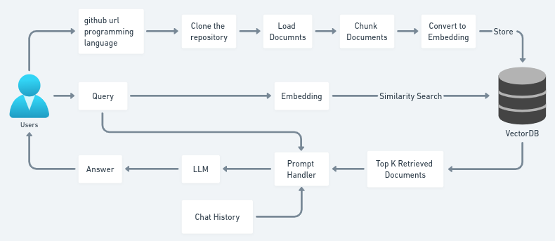

# Source-Code-Analysis-using-OpenAI

## How to run?
### STEPS:

### STEP 01- Clone the repository
```
git clone https://github.com/Sumegh20/code-analyzer.git
```
### STEP 02- Create virtual environment & Install requirements after opening the repository
```
bash init_setup.sh
```
### STEP 03- Create a .env file in the root directory and add your OPENAI_API_KEY credentials as follows:
OPENAI_API_KEY = "xxxxxxxxxxxxxxxxxxxxxxxxxxxxx"

### STEP 04- Activate the virtual environment
```
conda activate code_env/
```
### STEP 05- Finally run the following command
```
streamlit run app.py
```

### STEP 06- Open up localhost
```
http://localhost:8501/
```

## Code Architecture


## Techstack Used:
- Python
- LangChain
- Streamlit
- OpenAI
- GPT 3
- FAISS